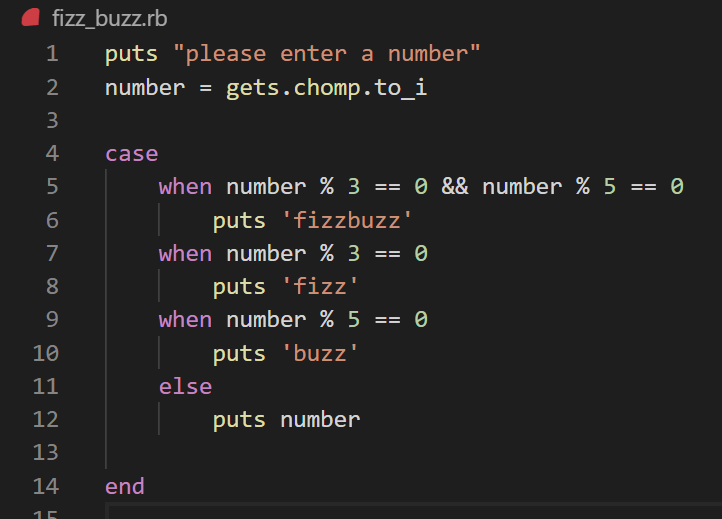
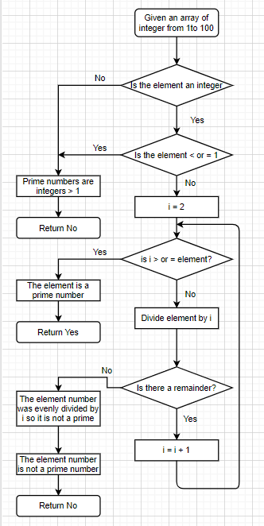

# Questions

## Question 1: Research the development of the internet from 1980 to today. You must describe at least FIVE key events in the development of the internet. You can refer to events, people of significance, or technologies and how they have changed over time.

    ⋅⋅1. In the year 1983, A new communications protocol was established called Transfer Control Protocol/Internetwork Protocol (TCP/IP). This allowed different kinds of computers on different networks to "talk" to each other. ARPANET and the Defense Data Network officially changed to the TCP/IP standard on January 1, 1983. So this year is considered as the birth year of the Internet.

    ⋅⋅2. In the year 1984, The domain name system was created along with the first Domain Name Servers (DNS). The domain name system was important in that it made addresses on the Internet more human-friendly compared to its numerical IP address counterparts. DNS servers allowed Internet users to type in an easy-to-remember domain name and then converted it to the IP address automatically (William 2009).

    ⋅⋅3. In the year 1990, Tim Berners-Lee invented HTML and a text browser, as well as a hypertext graphical user interface (GUI) browser. Then he established the first successful communication between a Hypertext Transfer Protocol client and a server via the Internet. These inventions were the makings of Web pages as we know them today (A simple history of the Internet 2014).

    ⋅⋅4. In the year 1995, Sun Microsystems first released Java, which still an immensely popular Internet programming language to this day (A simple history of the Internet 2014).

    ⋅⋅5. In the year 2006, Google CEO Eric Schmidt introduced the term “cloud computing” at an industry conference. “The Cloud” would become another synonym for the Internet soon thereafter (A simple history of the Internet 2014).


## Question2: Define the features of the following technologies that are essential in terms of the development of the internet

    ⋅⋅1. Packet
    ⋅⋅⋅In networking, a packet is a small segment of a larger message (Cloudflare n.d.). Data sent over the Internet, is divided into packets. These packets are then recombined by the computer or device that receives them.
    ⋅⋅⋅Packeting allows multiple computers can send over small packets of data over the same wires in basiclly any order.

    ⋅⋅2. IP addresses
    IP address is a numerical label assigned to each device connected to a computer network that uses the Internet Protocol for communication (Postel 1981). An IP address serves two main functions: host or network interface identification and location addressing.
    IPV4 defines an IP address as a 32-bit number. IPV6 using 128 bits for the IP address. 


    ⋅⋅3. routers and routing
    ⋅⋅⋅A router is a networking device that forwards data packets between computer networks (Oxford University Press n.d.). Routers perform the traffic directing functions on the Internet.

    ⋅⋅⋅Routing is the process of selecting a path for traffic in a network or between or across multiple networks (Routing n.d.). 


    ⋅⋅4. domains and DNS

    ⋅⋅⋅A network domain is an administrative grouping of multiple private computer networks or hosts within the same infrastructure.

    ⋅⋅⋅The Domain Name System (DNS) is a hierarchical and decentralized naming system for computers, services, or other resources connected to the Internet or a private network (Network domain n.d.). Humans access information online through domain names. Web browsers interact through Internet Protocol (IP) addresses. DNS translates domain names to IP addresses so browsers can load Internet resources.


## Question3: Define the features of the following technologies that are essential in terms of the development of the internet:
    ⋅⋅1. TCP
    ⋅⋅⋅The Internet Protocol (IP) is the address system of the Internet and has the core function of delivering packets of information from a source device to a target device. IP is the primary way in which network connections are made, and it establishes the basis of the Internet. IP does not handle packet ordering or error checking. Such functionality requires another protocol, typically TCP.
    ⋅⋅⋅TCP takes messages from an application/server and divides them into packets. TCP numbers each packet and reassembles them prior to handing them off to the application/server recipient (Transmission Control Protocol n.d.).
    
    ⋅⋅2. HTTP and HTTPS
    ⋅⋅⋅HTTP stands for Hypertext Transfer Protocol. When you enter http:// in your address bar in front of the domain, it tells the browser to connect over HTTP.
    HTTPS stands for Hypertext Transfer Protocol Secure (also referred to as HTTP over TLS or HTTP over SSL). When you enter https:// in your address bar in front of the domain, it tells the browser to connect over HTTPS.
    ⋅⋅⋅HTTP is unsecured while HTTPS is secured. And HTTP operates at application layer, while HTTPS operates at transport layer. Also HTTP sends data over port 80 while HTTPS uses port 443.

    ⋅⋅3. web browsers (requests, rendering and developer tools)
    ⋅⋅⋅A web browser etrieves information from other parts of the web and displays it on your desktop or mobile device. The information is transferred using the Hypertext Transfer Protocol, which defines how text, images and video are transmitted on the web.
    Users use web standards to create consistency between browsers. 
    ⋅⋅⋅When the web browser fetches data from an internet connected server and it then uses a piece of software called a rendering engine to translate that data into text and images. This data is written in Hypertext Markup Language (HTML) (web browser n.d.). 

## Question4: Identify THREE data structures used in the Ruby programming language and explain the reasons for using each.

    ⋅⋅1. Array is a collection that can be used to store a list of values. And an array will be stored in a variable.  
    Array usually be used:
        ⋅⋅* as a base for other data structures.
        ⋅⋅* to gather results from running a loop
    
    ⋅⋅2. Hash is a collection of key-value pairs. We can access value using "hash name"["keyname"] format.
    Hash be used:
       ⋅⋅* Counting characters in a string
       ⋅⋅* Mapping words to definitions, names to phone numbers, etc.
       ⋅⋅* Find duplicates inside an array
    
    ⋅⋅3. Stack is another data structure. Its structure looks like a stack of plates.
    stack be used: 
        ⋅⋅* Replaces recursive methods with a regular loop
        ⋅⋅* Reverse an array

## Question5:  Describe the features of interpreters and compilers and how they are different.

    ⋅⋅⋅Both interpreters and compilers are used to convert the source code by users to machine code written in binary (0 or 1).

    ⋅⋅⋅A compiler takes source codes of entire program and converts into machine code as a whole and stores in a file. The overall execution time of compiler convertion is faster than interpreters. Programming languages suc has C, C++, Java use compilers.

    ⋅⋅⋅An interpreter translates sources code by one statement at a time. The overall execution time of interpreter convertion is longer than compilers. Programming languages like JavaScript and Ruby use interpreters.

## Question 6:  Identify TWO commonly used programming languages and explain the benefits and drawbacks of each.

    ⋅⋅1. Python is a high-level, interpreted and general-purpose object-oriented dynamic programming language that focuses on code readability.
    ⋅⋅⋅Benefits of Python:
        ⋅⋅*Open-source language with large amounts of support libraries
        ⋅⋅*Python integrates the Enterprise Application Integration that makes it easy to develop Web services by invoking COM or COBRA components (Mindfire Solutions 2017).
    ⋅⋅⋅Drawback of Python:
        ⋅⋅*Python executes and converts source codes to machine codes using interpreter rather than compiler, which slows down its running speed.
        ⋅⋅*Python has made its presence on many desktop and server platforms, but it is seen as a weak language for mobile computing (Mindfire Solutions 2017).
    

    ⋅⋅2. Ruby is an interpreted, high-level general-purpose programming language. Ruby supports multiple programming paradigms, including procedural, object-oriented, and functional programming (Ruby n.d.).
    ⋅⋅⋅Benefits of Ruby:
        ⋅⋅*The code written in Ruby has a fewer number of lines of code
        ⋅⋅*This language allows simple and fast creation of Web application (Ruby Programming 2019)
    
    ⋅⋅⋅Drawback of Ruby:
        ⋅⋅*As a new langiage, Ruby's support communities is not as large as other languages. 

        ⋅⋅*Tim Bray, a Canadian developer who was Sun Microsystems's director of Web Technologies from 2004 to 2010, was quoted in 2008 as saying that Ruby is too slow, and that it can be 20 times slower than Java when processing (Johnson n.d.).

## Question 8: Explain control flow, using an example from the Ruby programming language
    ⋅⋅⋅In computer science, control flow is the order in which individual statements, instructions or function calls of an imperative program are executed or evaluated. A control flow statement is a statement that results in a choice being made as to which of two or more paths to follow. 
    
    ⋅⋅⋅Coding Example: 


    ⋅⋅⋅In above example, we first ask user to enter a number, and then convert answer value to integer and store as a variable called number.

    ⋅⋅⋅Then under the framework controlled by Case / When statements, user's input value will be reviewed to see if it could be divided by 3 and 5, or 3 or 5. Based on the reviews, based on the results of reviews during the flow, the user will get returns from "fizzbuuz', 'fizz", 'buzz" or just the entered value respectivly. 

## Question 9: Explain type coercion
    ⋅⋅⋅ As per MDN, Type Coercion refers to the automatic or implicit conversion of values from one type to another (Tandon 2020).

    ⋅⋅⋅ For example, if we eneter the code: '10' + 10 and to print, we can get the result string '1010' as the integer 10 is implicitly converted to string '10'.


## Question 10: Explain data types, using examples
    ⋅⋅⋅ In the programming languages, data type is an attribute of data which tells the complier ot interpreter how to developer intends to use the data. Main data types include string, integer, floating (with decimal points), and boolean. 

## Question 11: 
    ⋅⋅* Identify the classes you would use to solve the problem
        ⋅⋅* Sign-in/log-in function
        ⋅⋅* Product list
        ⋅⋅* select ordering amount
        ⋅⋅* delivery details
        ⋅⋅* Payment
    ⋅⋅* Short explanation to use the classes
        ⋅⋅⋅ New or existing customers will sign in or log into the ordering system using user name and password.

        ⋅⋅⋅ And the menu list will be displayed. Customer select the preferred meal and ordering amount.

        ⋅⋅⋅ Then customer will be moved to the transaction and delivery page to enter the delivery details and proceed payments

        ⋅⋅⋅ customer can update their log in details and log-off from system.

## Question 12: Identify and explain the error in the code snippet below that is preventing correct execution of the program
    ⋅⋅⋅In the line1, a string has been stored in the variable celsius. and put string value to calculation formula will cause the method error. 
    ⋅⋅⋅To avoid the error, we need to convert the value of celsius to integer before put it to calculation. In Ruby, we can use gets.chomp.to_i to convert to integer.

## Question 13: The code snippet below looks for the first two elements that are out of order and swaps them; however, it is not producing the correct results. Rewrite the code so that it works correctly.
    ```Ruby
    arr = [5,22,29,39,19,51,78,96,84]
    i = 0
    while (i < arr.size - 1 and arr[i] < arr[i+1])
        i = i+1
    end
    arr[i], arr[i + 1] = arr[i + 1], arr[i]
    puts arr
    ```

## Question 14(1): Create a flowchart to outline the steps for listing all prime numbers between 1 and 100 (inclusive) (2): Write pseudocode for the process outlined in your flowchart



    ⋅⋅⋅pseudocode:
        ⋅⋅* Given an array contains integer number between 1 and 100.
        ⋅⋅* looping each number of the array using for / each, if the number < or = 1, return No as prime numbers should great than 1, if the number great than 1, we will start a new if control flow nested in the flow for next step.
        ⋅⋅* Within the new flow, start an initial number as 2 and stored in a variable i. The number will be used to divide the array numbers
        ⋅⋅* Start a new if/else statement, if i > = the array element, it will return yes as the element number is a prime number.
        ⋅⋅* if i < the array element, then divide the array element by i.
        ⋅⋅* if there is no remainder, return 'not prime' as the element number can be divided by i. Else also return 'not prime' as remainder exists.
        ⋅⋅* Then increment i by 1 to test again.

## Question15: Write pseudocode OR Ruby code for the following problem: You have access to two variables: raining (boolean) and temperature (integer). If it’s raining and the temperature is less than 15 degrees, print to the screen “It’s wet and cold”, if it is less than 15 but not raining print “It’s not raining but cold”. If it's warm but not raining”, and otherwise tell them “It’s warm and raining”.
    ```ruby
    raining = false
    temperature = 14

    if raining && temperature < 15
        puts 'It’s wet and cold'
    elsif !raining && temperature < 15
        puts 'It’s not raining but cold'
    elsif !raining && temperature >= 15
        puts 'It’s warm but not raining'
    else
        puts 'It’s warm and raining'
    end
    ```

## Question 16: An allergy test produces a single numeric score which contains the information about all the allergies the person has (that they were tested for). The list of items (and their value) that were tested are:
 ⋅⋅* eggs (1)
 ⋅⋅* peanuts (2)
 ⋅⋅* shellfish (4)
 ⋅⋅* strawberries (8)
 ⋅⋅* tomatoes (16)
 ⋅⋅* chocolate (32)
 ⋅⋅* pollen (64)
 ⋅⋅* cats (128)

⋅⋅⋅So if Tom is allergic to peanuts and chocolate, he gets a score of 34.

⋅⋅⋅Write a program that, given a person’s score can tell them:
 ⋅⋅*a) whether or not they’re allergic to a given item
 ⋅⋅*b) the full list of allergies.

    ```ruby
    def allergy_score(score)
    new_allergy_array = []
    allergies = {128 => 'cats', 64 => 'pollen', 32 => 'chocolate', 16 => 'tomatoes', 8 => 'strawberries', 4 => 'shellfish', 2 => 'peanuts', 1 => 'eggs'}
    
    allergies.each do |number, allergy|
      if score - number >= 0
        new_allergy_array << allergy
        score = score - number
      end
    end  
      new_allergy_array
    end

    puts allergy_score(256)
    ```


## Referencing
    ⋅⋅* A simple history of the Internet, viewed 25 November 2020, <https://intetics.com/blog/a-simple-history-of-the-internet>

    ⋅⋅* William, C, 2009, The History of the Internet in a Nutshell, viewed 25 November 2020, <https://www.webfx.com/blog/web-design/the-history-of-the-internet-in-a-nutshell/>

    ⋅⋅* Cloudflare, n.d., How does the Internet work, viewed 26 November 2020, <https://www.cloudflare.com/learning/network-layer/how-does-the-internet-work/>

    ⋅⋅* Postel, J, 1981, Internet Protocol, DARPA Internet Program Protocol Specification, viewed 27 November 2020, <https://tools.ietf.org/html/rfc791>

    ⋅⋅* Oxford University Press, n.d., Oxford English Dictionary, viewed 27 November 2020, <https://en.wikipedia.org/wiki/Router_(computing)#cite_note-2>

    ⋅⋅* Wikipedia, n.d., Routing, viewed 28 November 2020, <https://en.wikipedia.org/wiki/Routing>

    ⋅⋅* Wikipedia, n.d., Network domain, viewed 28 November 2020, <https://en.wikipedia.org/wiki/Network_domain#:~:text=A%20network%20domain%20is%20an,Domain%20Name%20System%20(DNS)>

    ⋅⋅* SDxCentral, n.d, Transmission Control Protocol (TCP), viewed 29 November 2020, <https://www.sdxcentral.com/resources/glossary/transmission-control-protocol-tcp/>

    ⋅⋅* web browser, n.d, What is a web browser, viewed 30 November 2020, <https://www.mozilla.org/en-US/firefox/browsers/what-is-a-browser/>

    ⋅⋅* Mindfire Solutions, 2017, Advantages and Disadvantages of Python Programming Language, viewed 30 November 2020, <https://medium.com/@mindfiresolutions.usa/advantages-and-disadvantages-of-python-programming-language-fd0b394f2121>

    ⋅⋅* Ruby, n.d, Ruby (programming language), viewed 30 November 2020, <https://en.wikipedia.org/wiki/Ruby_(programming_language)>
    
    ⋅⋅* Ruby Programming, 2019, Ruby Programming Language: Advantages and Disadvantages Explained, viewed 30 November 2020, <https://technographx.com/ruby-programming-language/>

    ⋅⋅* Johnson, S, n.d., The Disadvantages of Ruby Programming, viewed 30 November 2020, <https://www.techwalla.com/articles/the-disadvantages-of-ruby-programming>

    ⋅⋅* Tandon, K, 2020, Type Coercion in JavaScript, viewed 1 December 2020, <https://medium.com/developers-arena/type-coercion-in-javascript-c973b369b272>


 


    


